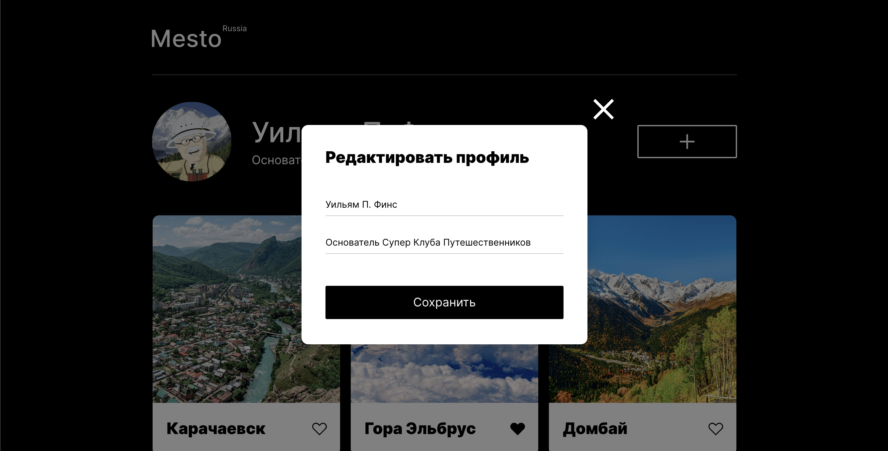

# Проект: Место

### Обзор
Социалочка для путешественников!
В данном проекте уже использульзуется связка из основных технологий веб-разработки: HTML, CSS и JavaScript.

## Какие техники применялись:

* HTML
* CSS - гриды, флексы, адаптивная верстка
* JavaScript - взаимодействие с DOM. Передача встраивание введенных пользователем в сайт
* GIT - разработка с ветками и по стандарту Conventional Commits
* БЭМ - файловая структура по данному стандарту

## Что планирую доработать:
* Планирую исправить ошибки выявленые ревьюером
* Заменить иконки лайков на векторные, для более гибкого редактирования (при лайке плавно заливать иконку например)
* Реализовать возможность добавлять новые фото
